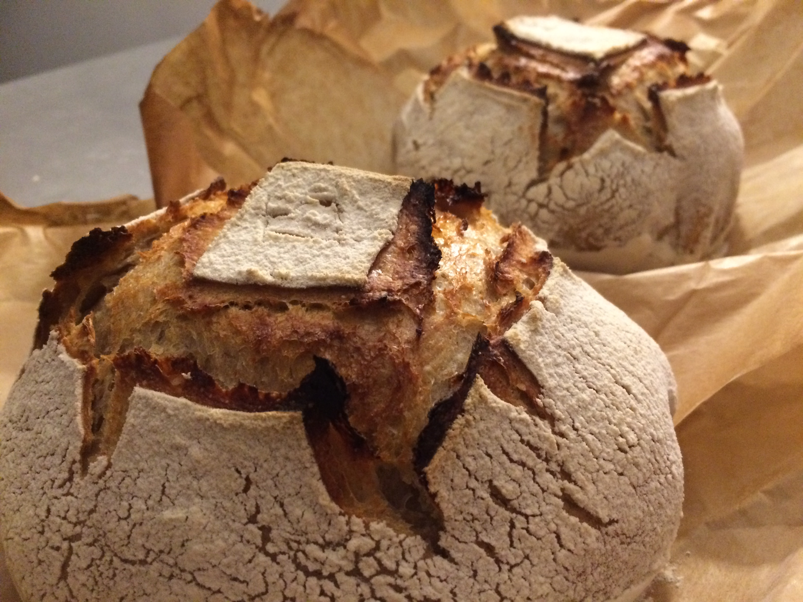
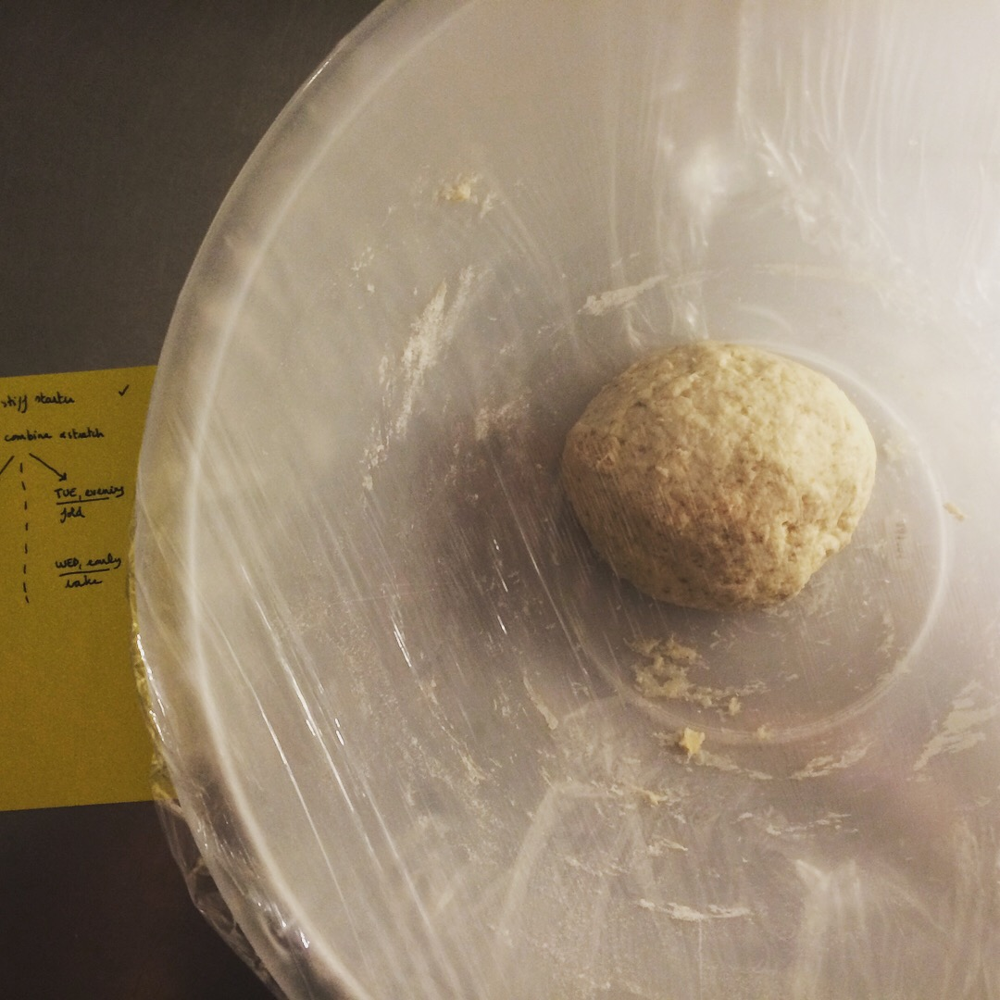
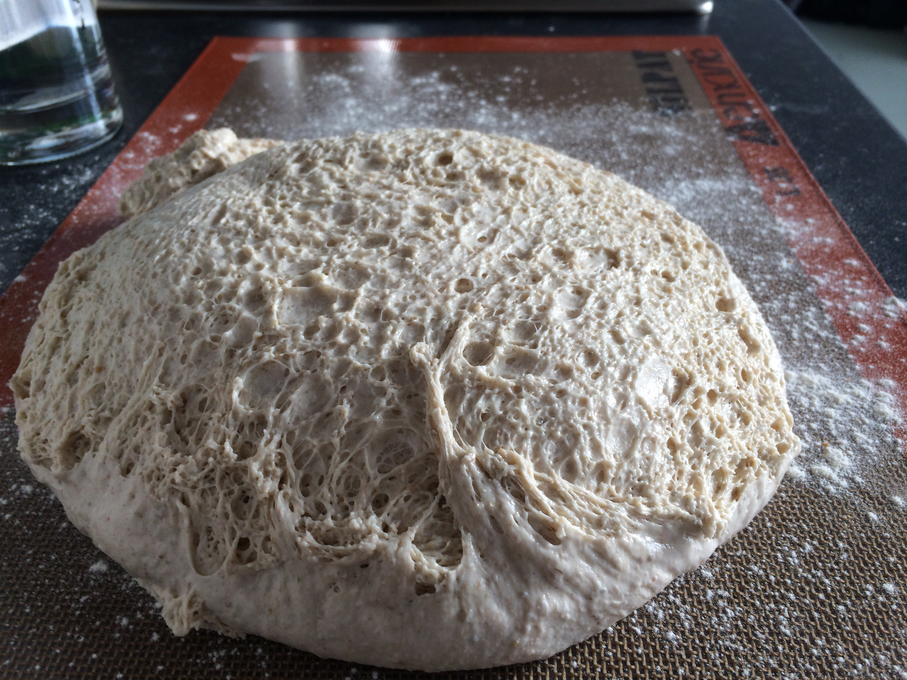
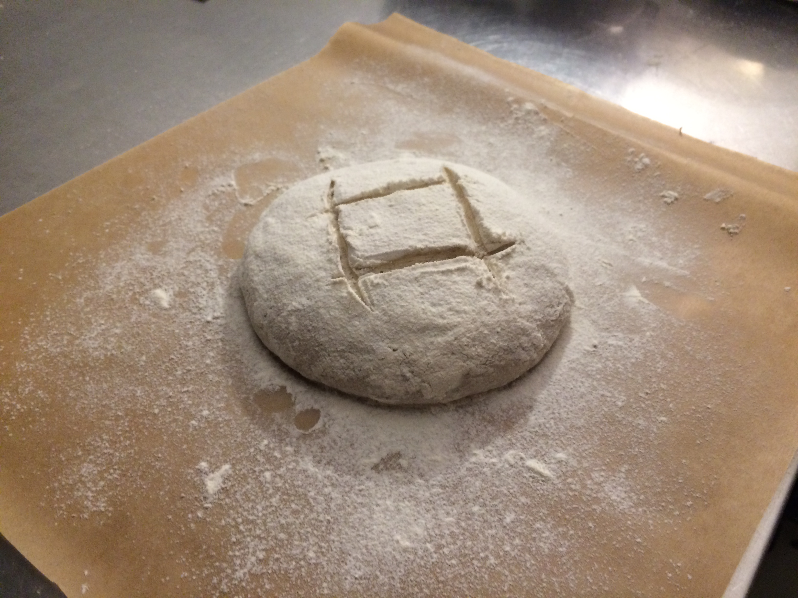

# Le Pain de campagne

## Day one

Prepare a _stiff starter:_

- 40g from your wild yeast starter (bubbly and ready to roll)
- 85g white flour
- 40g water

Mix it properly, leave covered for 18-24h.

## Day two

For a 60% hydration dough, prepare:

- the stiff starter you prepared yesterday
- 350g water
- 480g flour: 450 white + 30 rye or 210 white + 210 wholemeal + 60 rye
- 8g salt

Add the starter to the water. It should float. [Like a duck](https://www.youtube.com/watch?v=zrzMhU_4m-g). Then add the rest.

Stretch and tear on a lightly floured surface until the dough is elastic and velvety. Cover and refrigerate for 8 to 24h.

## Day three

We expect the dough to be showing visible signs of fermentation, mostly big bubbles at the surface, accompanied by a wobbly feeling of the whole.

Give the dough a fold, then rest 30 minutes. Repeat twice. Preshape, rest on the counter for 30 minutes, then shape the boule or batard. Rest it upside down in a heavily floured proving basket, banneton, or tea towel. Cover with cling film, and let it prove in the fridge for 8 to 12 hours.

### Day four

Pre-heat the oven to 250C.

Turn your dough onto a dust peel with semoline on top. Score the dough (the square pattern above is recommended for beginners and consistency), bake in the oven for 30 minutes. Occasionally spritz water into the oven. 

