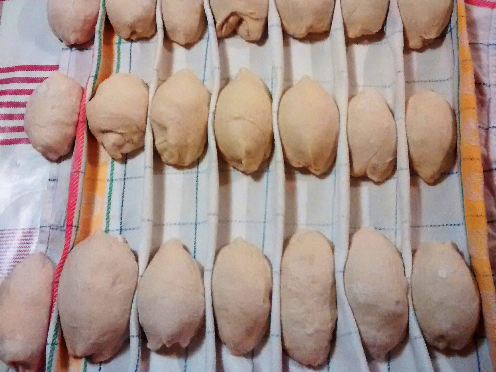

# Le Pain

Picture yourself a Frenchman alienated in London for an unknown period of time.
Good bread is hard to come by and stupidly expensive (okay, not *that* hard, but
still expensive). On the other hand, cooking sourdough bread all by yourself
will fill you with undeniable pride and provide a true sense of self-achievement.

## Ingredients

The secret of a good bread dough resides in these weight proportions: **1, 2,
3**.  Memorize them and you'll be able cook bread for yourself or for a
 40-guest banquet.

* 1 unit of sourdough
* 2 units of mineral or filtered water[^1]
* 3 units of flour (obviously not self-raising, but can be a mix of plain white
flour and other kind of flour -- wholewheat, rye, etc.)[^2]
* Seeds, herbs or dry fruits to suit your taste
* And of course salt (roughly 10g per kilogram of dough)

Experiments demonstrated that 200g of sourdough is a good base, as it will
give you enough material to work with.

## Making the dough

### *Autolyse*

First, put all the ingredients **but the salt** in a big bowl, and stir with a
spoon just long enough to allow everything to be coarsely mixed. Put a wet
towel on top of the bowl and leave it for 20~40 minutes. During this first phase
called *autolyse*, the sourdough will start bonding with the flour and water,
without being hindered by the salt.

### Slap and Fold

Then it's time to knead the dough. Spill the mix on a clean and solid surface,
flatten it and put the salt on the middle (**do not forget the salt**). Then
play a long song or a short series episode and repeatedly follow these steps:

* Fold the dough over itself in one direction, squashing it *gently* in the
process
* Fold it again in the perpendicular direction

From time to time, lift the ball of dough completely from the work surface, and
slap it back on the table firmly (don't hold yourself - the sound has to be
 reminiscent of the one of spanking).

As you fold and slap the dough more and more, you will notice that its texture
is changing. It will hold itself together better, and will become less sticky
and more elastic. This is what we are after.

### Raises

Once you're there, make a nice ball shape of the dough on the work plan, clean
around it and cover it with a wet towel.

Twice, leave it for 1-2 hours and fold it 5 or 6 times (using your hands, or
better yet a dough scraper). Put the wet towel back on in between. These
additional folding steps will help develop better taste and texture for the
crumb.

After that, put the wet towel back on and leave the dough for the final raise.
It should last for at least 4 hours, but it is no problem to extend
it to 6-8 hours.

## Cooking the dough

Turn on the oven and set it to 240C. While it is preheating, model your dough in
whatever shape you fancy.

### Dough shaping 101

Whatever the final shape you wish to obtain, the principles are the same.

* Take a chunk of dough and flatten it in a roughly triangular shape --
**gently** (otherwise you'll chase the air out of it and end up with the dreaded
brick)
* Fold back two vertices of the triangle on it, and roll it on itself starting
from the remaining vertex.
* Roll this *paton* **gently** (again, the brick) in flour, to ease further
manipulation.
* Put it aside on a towel (this time dry and generously covered with flour), and
make little walls on the side with the towel. You will put the next loaf right
next to the first one so that they don't "spill" while waiting for the oven to
reach its temperature.

That's for a loaf. Should you wish to have something more akin to a *baguette*
(and honestly who wouldn't?), you just have to roll it a bit more to elongate
it.

### The proper cooking

Once all of the dough is shaped and your oven nicely heated, boil 400 mL of
water and spill it in your oven dripping pan (be cautious there, there will be a
lot of steam, and steam is hot).

Then put your loafs on a cooking plate, cut them regularly using a sharp knife
or razor blade, and put the plate on the middle of the oven and let them cook
for 30 minutes or so. The bigger the loafs, the longer the cooking. You will
know the loaf is cooked upon hearing a hollow sound when knocking on it.[^3]

[^1]:
    You may want to put slightly less water in your dough, e.g. going from 2
    units to 1.9~1.8. This depends on the flour(s) you are using: some of them
    are better at absorbing the water (whole flours and flours with lots of
    gluten are generally better at this). Ultimately, kneading the dough a bit
    longer should help attain the desired texture even if you stick to 2 units.
    Be also aware that a more solid dough will tend to rise less.

[^2]:
    As a general rule, the more you use "heavy" flours (wholewheat) and external
    additives (seeds, fruits, etc.), the less aerated your bread will be.  For
    flour, a good base is to use no more than one third (of the total flour
    weight) of "heavy" flour (other than plain white).

[^3]:
    You have quite some latitude in terms of cooking duration. Less cooked will
    contain more humidity, and as such will be softer and more elastic. Also,
    you will be able to keep it for longer before it becomes hopelessly hard. On
    the other hand, it's harder to grill and some may find it heavier to digest.
    Some also just prefer the texture of a more cooked bread.
