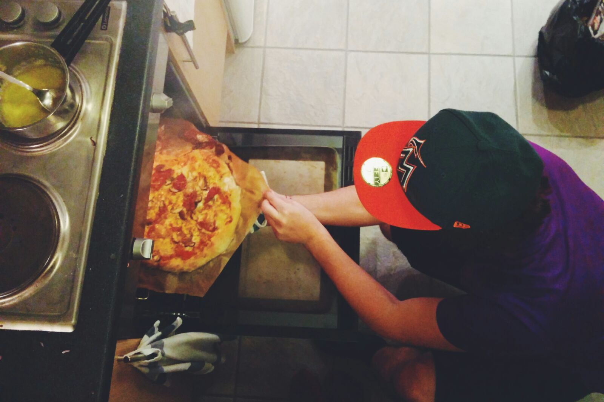
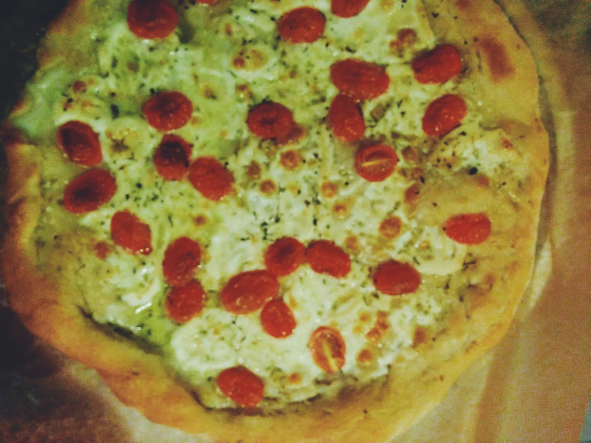

# La Pizza

Using sourdough instead of or in addition to regular dry yeast not only greatly improves taste, but is also the occasion to bring a bit of life in your your pizza dough, to get started with the obscure sourdough cult, and to be more of a a proper organic-grown pizza-eating, mustache-sporting, bike-polo-playing hipster.

## Dough

For two standard size doughs:

* 100g sourdough starter
* 3-5g dry yeat
* 300ml mild water (Brita the crap out of it otherwise it's no hype)
* 500g flour (type 00)
* Big pinch o'salt

Mix water, starter, and yeast in a large bowl for 10 minutes, ideally till bubbly (indicating that the dry yeast has starter doing its thing). Add Flour and salt, knead hard.

Place under the bowl for an hour at room temperature. This time is called "*pointage*."

Fold the dough on itself a few times. Place under the bowl once again.

When enough rise has taken place, divide into patons, oil them slightly and place them in a well-oiled tupperware that will spend a day or two in the fridge for their final proof.

## Recipes

### Reina

* Tomatoes
* Mushrooms
* Prosciutto, parma ham (anything Italian and expensive)
* Mozzarella (cooking mozza, rectangular and dry)
* Grated parmesan
* Extra-virgin olive oil (expensive one, please)
* Basil (home-grown)

You've got to make your own tomato sauce, otherwise you're better off buying a frozen pizza at Lidl. The simplest way to up your tomato sauce game is to cut the tomatoes and slowly cook them. Give the sauce a stir every 15 minutes, add extra-virgin olive oil, black pepper, salt. That will take you a couple of hours, but your dough's rising anyway.

Put the tomato sauce on the dough, then add the cubes of mozza on top, on all the surface. Slice the mushrooms and throw that on top, then add the ham. The parmesan comes last.

Heat the oven as much as you can while you do this. It'll never be hot enough to cook your pizza properly anyway.

Pro-tip: put some extra-virgin olive oil on your fresh basil leaves before you cook your pizza in the oven, otherwise they'll burn.

Cook the thing. Add a drizzle of extra-virgin olive oil. Eat the pizza.

### Caprese

* Mozzarella di Bufala
* Cherry tomatoes
* Extra-virgin olive oil (expensive one, please)
* Balsamic vinegar

Spread some extra-virgin olive oil on your dough, and add on top the slices of mozza.

In between slices of mozza, you will add cut-in-half tomatoes. Drizzle some more extra-virgin olive oil, and cook in the oven until it doesn't look all liquid on top.

Drizzle a large stream of balsamic vinegar on top when taking the pizza out of the oven. Eat the pizza. Don't burn yourself.
